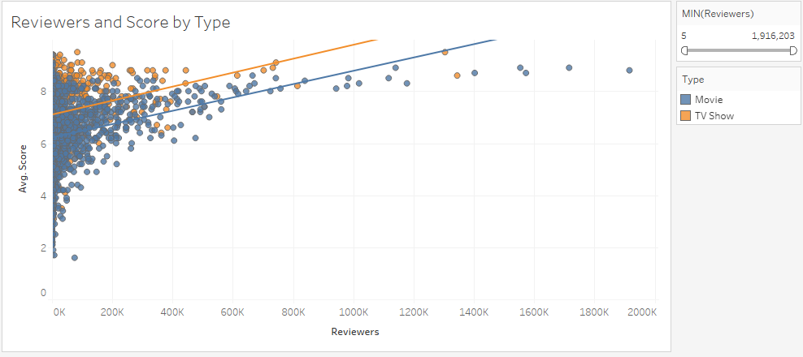

# Netflix Content Recommendations

## Introduction and Setup
The insights of this project were obtained through a dataset that reflects the content of Netflix in 2018 and also a dataset of IMDB ratings. Both of these datasets I gather on Kaggle. First, I used Excel to combine the two datasets and then I read that csv into RStudio to be cleaned and organized into a final dataset. 

In RStudio I removed all rows that did not provide an average score from IMDB. I then used regular expressions to create a column for average score and the number of reviewers for each movie/TV show. After creating the final dataset in RStudio I loaded this into Tableau to create visualizations.

## Reviewers and IMDB Score

This graphic gives us a general layout for the distribution of IMDB scores compared to number of reviewers in regards to movies and TV shows. A few takeaways are that it appears if a production has more reviewers then the IMDB score is likely to be higher. This could be that more people feel the need to compliment productions they feel are very good. We can also see that the distribution between movies and TV Shows are similar.

## Movie Score by Rating

In the visual, bigger circles mean that there is more movies in that demographic and darker colors carry a higher average score. Netflix has a nice balance of different rated movies with similar average scores. In the video it shows that the two highest scored rating categories are NC-17 and NA which is likely an unknown rating. However, there is not enough movies in these areas to make a recommendation to add more of them.

## Movie Score by Genres

In this visual we see some possible areas of improvement for Netflix. There are some quadrants in the heat map that are small and darker red than others. These genre combinations should be explored and possible add more of these types of movies since people seem to rate them higher. Areas, where Netflix should consider removing movies from are the larger, almost white boxes.

## TV Show Score by Rating

Now, for TV shows it looks similar to maturity rating in movies where the larger circles are some of the darker circles. This is what we would like to see. Some of the darkest circles includ R-rated TV shows and PG-rated shows. However, these are very small sample sizes to know for sure if customers would want more of these.

## TV Show Score by Genres

The breakdown of average scores by TV show genre also shows some room for opportunity. There are several smaller darker blue quadrants that represent possible TV show genres Netflix should try to expand on considering they have higher average scores than larger and closer to white quadrants such as Kids' TV and Kids' TV/TV Comedies.

## Conclusion and Recommendations
After taking all of the visuals into consideration there are some recommendations that can be made for Netflix. For Netflix movies, I recommend that they add more movies in these four genre combinations: 1) Documentaries, Sports Movies. 2) Action & Adventure, Anime Features, International Movies. 3) Documentaries, Music & Musicals. 4) Documentaries, International Movies, Sports Movies. Then reduce the amount of movies that are in the Comedies, International Movies and the Children & Family Movies, Comedies. The four recommended genre combinations showed that they are among the highest average scored genres while also having fewer movies than most of the other genre groupings. By expanding on these genre groups more customers may be more interested in what Netflix can offer for movies.

My recommendation for TV shows are to add more TV shows on Netflix in the genre of: 1) TV Dramas. 2) British TV Show combinations 3) Docuseries, Science & Nature TV. Netflix should also remove some Kids' TV shows and Kids' TV/TV Comedies since they hold lower average scores. Also, I think that Netflix should explore creating/adding TV shows in these recommended genres while exploring shows with maturity ratings of PG or R.

By adding shows and movies in areas that demonstrate higher average scores and removing those in areas that have lower average scores. Doing this is applying the logic of focusing on things that you are good at and applying less focus in areas that you perform poorly in. This strategy will hopefully enhance the quality of productions that Netflix has to offer its customers. 
