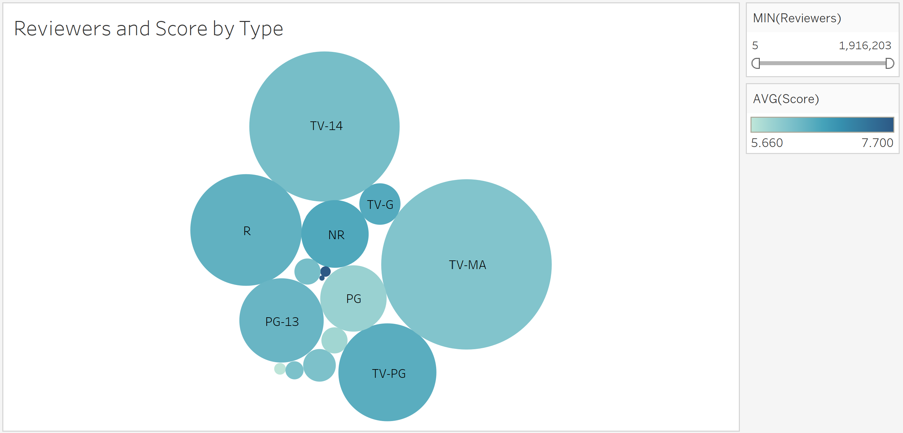

# Netflix Content Recommendations

## Introduction and Setup
The insights of this project were obtained through a dataset that reflects the content of Netflix in 2018 and also a dataset of IMDB ratings. Both of these datasets I gather on Kaggle. First, I used Excel to combine the two datasets and then I read that csv into RStudio to be cleaned and organized into a final dataset. 

In RStudio I removed all rows that did not provide an average score from IMDB. I then used regular expressions to create a column for average score and the number of reviewers for each movie/TV show. After creating the final dataset in RStudio I loaded this into Tableau to create visualizations.

## Reviewers and IMDB Score

This graphic gives us a general layout for the distribution of IMDB scores compared to number of reviewers in regards to movies and TV shows. A few takeaways are that it appears if a production has more reviewers then the IMDB score is likely to be higher. This could be that more people feel the need to compliment productions they feel are very good. We can also see that the distribution between movies and TV Shows are similar.

## Movie Score by Rating

Let's take a closer look at the Movies on Netflix and how the different recommended age ratings are scored on average

## TV Show Score by Rating

